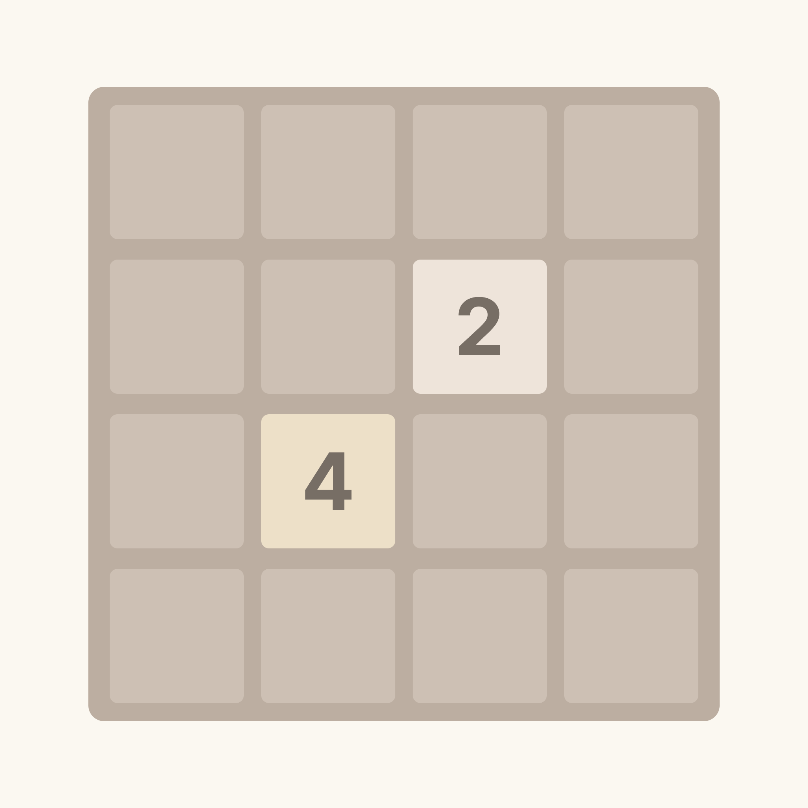
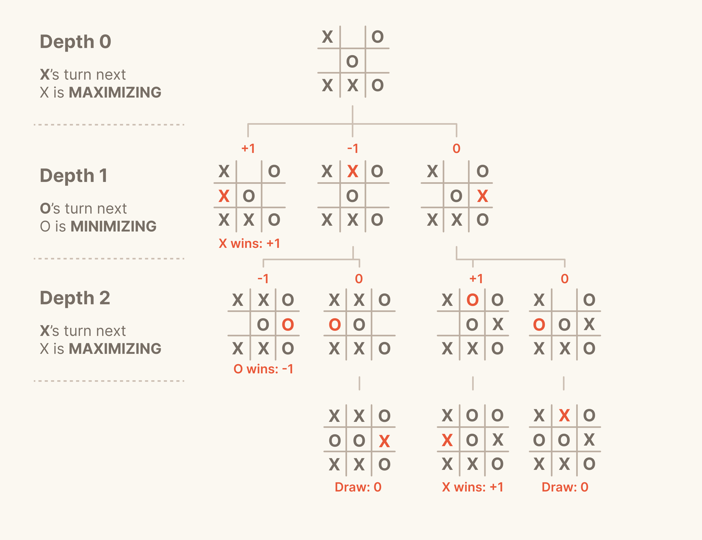
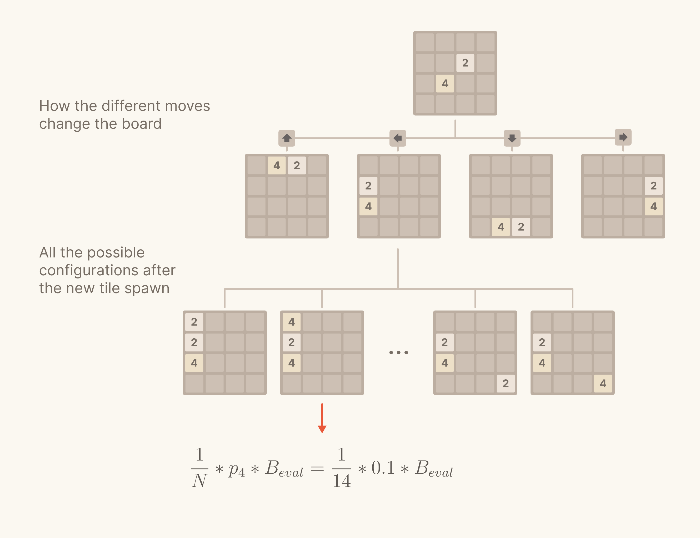

# 2048-Bot
This repository houses the source code for a 2048-playing bot, designed to autonomously play the popular 2048 puzzle game, recreated in Python using Pygame

## 1. Folders
In this repository you'll find three folders:
- 📁 **base**: Here you can find the base code for the 2048 game implemented in Pygame, with NO automation. You can play it using the keyboard arrows.
- 📁 **automatic**: Here you can find the code for the 2048 game which is played by the Expectiminimax bot.
- 📁 **experiments**: A little extra, this was my first experiment using Reinforcement Learning. For the ones interested in giving this method a second chance, here you can find the code that I used, including a custom Gymnasium Environment for the game.

## 2. Execution
In order to execute the code of one of the above folders, you can follow these instructions:

- Open a terminal and navigate in your desired directory
- Clone this repository using `git clone https://github.com/Borotalcohol/2048-Bot.git`
- Move inside the just cloned repository with `cd 2048-Bot`
- Move inside one of the desired folder, for example, `automatic` -> `cd automatic`
- Create a Python virtual environment using `python3 -m venv venv`
- Activate the virtual environment with `source venv/bin/activate` (Linux and MacOS) or `./venv/Scripts/activate` (Windows)
- Install the packages with `pip install -r requirements.txt`
- Run the main script in the folder: `python3 main.py`

## 3. Explanation
This is a brief explanation of the standard solution adopted in the bot implemented in the `automatic` folder:

### 3.1 2048 Game Introduction
2048 is a puzzle game played on a 4x4 grid. Your mission is simple: slide tiles left, right, up, or down to merge those with matching numbers. When you do this, they combine into a single tile with double the value.

Your ultimate goal? Reach that prized 2048 tile. What's intriguing is that once you achieve it, you face a choice: pause and celebrate your triumph or continue the journey to create even larger tiles like 4096, 8192, and beyond.

Quick Game Recap:

🟡 The game unfolds on a 4x4 grid.
🟡 Two initial tiles with random values set the stage for your journey. 🎲🌟
🟡 Each move that alters the board spawns a new tile randomly (with value 2 with a 90% probability and value 4 with a 10% probability).
🟡 Combining adjacent tiles with identical values results in a single tile with double the value (2 and 2 make 4, 4 and 4 make 8, and so on).
🟡 The game ends when you can no longer make a move that changes the board. ❌🛑

### 3.2 Tic-tac-toe and Minimax
Let's delve deeper into our solution by grasping a pivotal concept in decision theory: Minimax. 🧠

🎲 What is Minimax?

In the realm of game theory, Minimax stands out as a foundational strategy utilized in two-player games with outcomes falling into three categories: win, lose, or tie.
At its core, Minimax involves players strategically pursuing victory. Each player, in their turn, aims to make the optimal move leading to a win while hindering their opponent's progress.

To simplify, at every stage of the game, players aim to:
📈 MAXIMIZE their MINIMUM potential gain.
📉 MINIMIZE their opponent's MAXIMUM potential advantage.

This dual-sided strategy is aptly named "Minimax." 🔄

🎲 Applying Minimax to Tic-tac-toe
How does Minimax relate to the classic Tic-tac-toe game? In Tic-tac-toe, players (let's call them 'X' and 'O') take turns striving to win while blocking the opponent. They make moves to MAXIMIZE their chances of winning and MINIMIZE their opponent's opportunity for victory.

If we consider 'X' on its turn, a MINIMAX algorithm would evaluate all potential moves as follows:
- If a move leads to a win, assign a positive value (e.g., +1) and return.
- If not a winning position, evaluate possible adversary moves:
 - If the adversary can win, return a negative value (e.g., -1).
 - If not, evaluate all possible moves for 'X' from this new position.

This recursive approach continues until reaching a draw, a winning position, or a predetermined maximum depth to manage computational complexity.

The algorithm calculates evaluations for upper nodes by selecting the minimum value during "minimizing" turns (we take the least favorable state evaluation because we are pretty sure that the adversary will probably make the most favorable move for him) and the maximum value during "maximizing" turns (same reasoning but during our turn).

### 3.3 Expectiminimax

Why and how apply Minimax to our 2048 bot? Let's unravel the mystery.

While you might think you're solo in the 2048 game, it's a bit like facing off against the game's algorithm, spawning tiles randomly after each move.

🎲 Now, this "enemy" isn't playing to win; it's just tossing tiles randomly onto your board. So, how does minimax logic fit into this with the UNCERTAINTY of random tile spawns?

Enter the Expectiminimax algorithm.

The name itself reveals a focus on the "expected" value in decision-making, tackling the uncertainty of random tile spawns. Given the 2048 board's current state, we can predict four possible moves (up, down, left, right), but we don't know where or which tile will appear after the move. Probability theory steps in to bridge this gap.

Consider this:

**N**: number of empty tiles after a move
**p_2**: probability of a 2 tile spawning (90%)
**p_4**: probability of a 4 tile spawning (10%)
**B_eval**: a "goodness" score for a specific board configuration
We evaluate each possible outcome with the formula:

**(1 / N) * p_2 * B_eval** -> for a 2 tile spawn
**(1 / N) * p_4 * B_eval** -> for a 4 tile spawn
In simpler terms, we're weighing the "goodness" score by the probability of that configuration appearing after the move.

To determine the best next move, we construct a tree to evaluate future states, considering the uncertainty component:

1️⃣ Start from the current game state (root of the tree)
2️⃣ Determine how the board changes with all 4 moves (excluding the random tile)
3️⃣ These modified boards become the root's children
4️⃣ For each board, the children include all possible tile spawn configurations

This procedure continues until a maximum given depth. Unlike Tic-tac-toe, this is computationally heavy, but with a depth of 1, we achieve decent results, reaching the 2048 tile most times.

Alright, we’re missing a single but very important thing now, how do we evaluate the “goodness” of a board configuration? (That is, how do we determine **B_eval** given a board config?)

### 3.4 Snake Heuristic

## 4. Contribution
Feel free to fork this repository and work on your own solution!
I will leave the opportunity to contribute open for a while and then move on to implementing a website where I will cite those that helped reaching better results!
